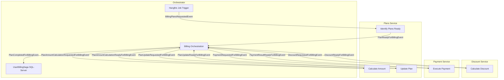
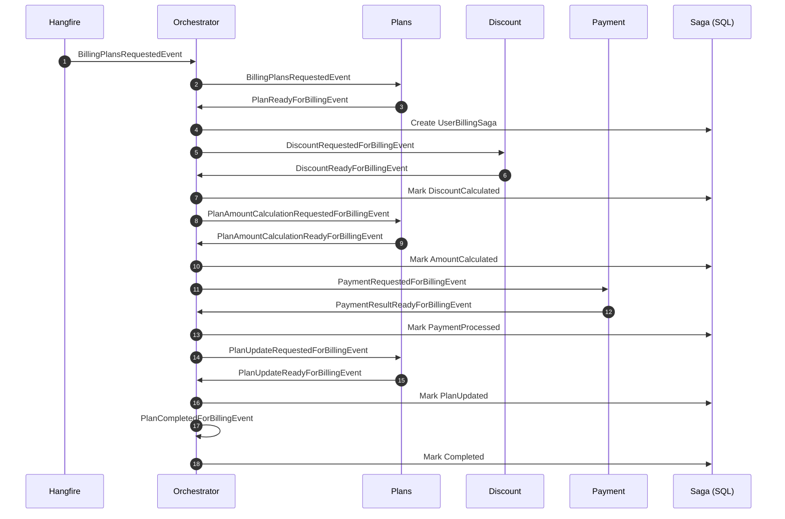

# Billing System – Distributed SAGA Orchestration

This project implements a simplified distributed billing workflow using a **SAGA pattern** coordinated by an **Orchestrator** service.  
It demonstrates how multiple microservices collaborate asynchronously through **RabbitMQ events**, with state tracked in a **UserBillingSaga** persisted in **SQL Server**.

The system is intentionally minimalistic and focuses on illustrating the orchestration flow rather than production‑grade resiliency patterns.

---

## 📦 Services Overview

### Orchestrator
- Coordinates the entire billing SAGA.
- Uses **Hangfire** to trigger recurring billing jobs.
- Publishes and consumes events across RabbitMQ.
- Persists and updates **UserBillingSaga** entities using **Entity Framework**.
- Ensures each user’s billing process transitions through well‑defined states.

### Plans Service
- Determines which plans are ready for billing.
- Provides plan pricing.
- Calculates final billing amounts (price – discount).
- Updates plan status after payment (Active / Cancelled).

### Discount Service
- Computes the discount applicable to a user’s plan.
- Returns discount values to the Orchestrator.

### Payment Service
- Executes the actual payment.
- Handles payment errors and returns result codes.
- Reports success/failure back to the Orchestrator.

---

## 🧩 Technologies Used
- **Aspire** – service orchestration and hosting.
- **Hangfire** – recurring background jobs.
- **Wolverine** – messaging, event handling, and RabbitMQ integration.
- **Entity Framework Core** – persistence of SAGA state.
- **RabbitMQ** – asynchronous communication between services.
- **SQL Server** – durable storage for billing SAGA state.

---

## 🔄 Billing Workflow Summary

1. **Hangfire** triggers a billing job in the Orchestrator.
2. Orchestrator publishes **BillingPlansRequestedEvent**.
3. Plans Service identifies plans ready for billing → publishes **PlanReadyForBillingEvent**.
4. Orchestrator creates a **UserBillingSaga** and requests discount.
5. Discount Service returns discount → **DiscountReadyForBillingEvent**.
6. Orchestrator requests amount calculation.
7. Plans Service calculates final amount → **PlanAmountCalculationReadyForBillingEvent**.
8. Orchestrator requests payment.
9. Payment Service processes payment → **PaymentResultReadyForBillingEvent**.
10. Orchestrator requests plan update.
11. Plans Service updates plan → **PlanUpdateReadyForBillingEvent**.
12. Orchestrator marks SAGA as completed.

### 🧠 **UserBillingSaga State Machine**

Each step is event‑driven and transitions the SAGA through strict states.

| State | Meaning |
|-------|---------|
| Pending | Saga created, waiting for discount |
| DiscountCalculated | Discount received |
| AmountCalculated | Final amount computed |
| PaymentProcessed | Payment executed |
| PlanUpdated | Plan updated after payment |
| Completed | Saga finished |
| Failed | Error occurred (retryable) |

---

### 🗂️ **Events**

#### **Plan Discovery & Initialization**
- `BillingPlansRequestedEvent`
- `PlanReadyForBillingEvent`

#### **Discount Calculation**
- `DiscountRequestedForBillingEvent`
- `DiscountReadyForBillingEvent`

#### **Amount Calculation**
- `PlanAmountCalculationRequestedForBillingEvent`
- `PlanAmountCalculationReadyForBillingEvent`

#### **Payment Processing**
- `PaymentRequestedForBillingEvent`
- `PaymentResultReadyForBillingEvent`

#### **Plan Update**
- `PlanUpdateRequestedForBillingEvent`
- `PlanUpdateReadyForBillingEvent`

#### **Completion**
- `PlanCompletedForBillingEvent`

## ⚠️ **Important Considerations**

This project is intentionally **naive** and omits several production‑critical patterns:

### ❌ Missing Production‑Grade Patterns
- **Outbox pattern** for guaranteed event delivery  
- **Inbox pattern** for idempotency  
- **Retry policies** with exponential backoff  
- **Dead‑letter queues**  
- **Distributed tracing**  
- **Poison message handling**  
- **Concurrency control** for SAGA updates  

These should be added before using this architecture in a real billing system.

### 🧵 Process Execution Status (Future Work)
A planned enhancement includes:

- A **separate background job** that reads SAGA state
- Updates a **BillingProcessExecution** table
- Without interfering with the billing workflow itself

This allows dashboards or monitoring tools to track billing progress independently.

---

## 🚀 **Purpose of This Project**

This repository serves as a **learning and demonstration tool** for:

- SAGA orchestration  
- Microservice collaboration  
- Messaging workflows  
- Distributed state management  
- Hangfire and Wolverine integration in such contexts

It is not intended as a production‑ready billing system.

---

Follow me here on [GitHub](https://github.com/xaberue), [LinkedIn](https://www.linkedin.com/in/xaberue/) or [BlueSky](https://bsky.app/profile/xaberue.bsky.social)